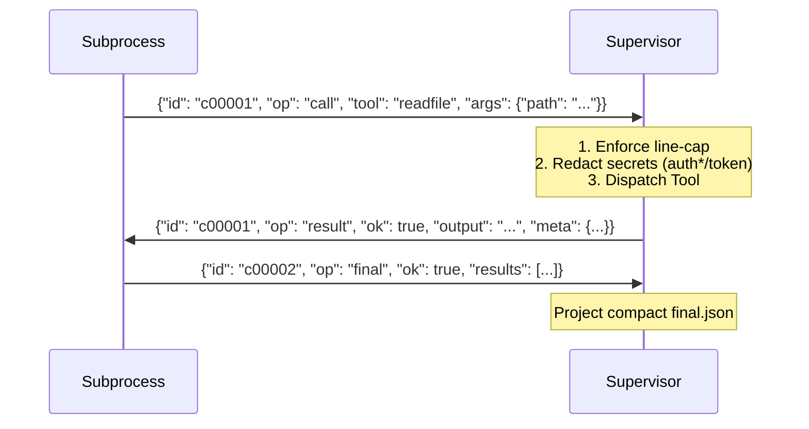

# ADR 002: PIRML V2 Substrate: Deterministic Subprocess RPC & Observability

## Status: ACCEPTED (2026-02-20)

## Context:
V1 was a monolithic prototype. V2 enforces a strict subprocess boundary for program execution with deterministic observability, forensic auditing, and no-tool replay.

## Decision:
### 1. Protocol Algebra: {call, result, final}
- **3-Op Only:** `op=log` REJECTED. Human diagnostics -> stderr. Machine transcript -> stdout (NDJSON).
- **Finality:** Exactly one `final` per run. `final` is terminal. Unknown `result.id` or `final.id` => Hard Fail.
- **RPC:** Subprocess calls (`call`), Supervisor responds (`result`). Program sends (`final`) to exit.

### 2. ID Policy: c%05d Monotonic
- **Fixed Width:** `c00001`, `c00002`... Stable width 5 for diff alignment.
- **Monotonicity:** Mandatory. Replay assumes temporal ordering == lexical ordering.

### 3. Artifact Dual-Projection: {trace.ndjson} vs {final.json}
- **Trace (Product):** Enveloped, hashed, forensic-rich transcript of all frames.
- **Final (Summary):** Compact contract-only view for stakeholders (PO). No raw tool blobs.
- **Metrics (KPI):** Single row CSV capturing performance (ms, retries, ok, sha).

### 4. Determinism Invariants (HC1)
- **Clock:** SequenceClock (0, 1, 2...) for timestamps.
- **JSON:** Canonical sort_keys, no extra separators.
- **Environment:** Pins for PYTHONHASHSEED, TZ, LC_ALL, SDE.

### 5. Replay Parity (HC4)
- **Blocking:** `PIRML_BLOCK_TOOLS=1` replay reproduces live `final.json` hash.
- **Cassette:** Adapter-boundary ID->Result mapping. Replay executes ZERO tools.
- **Integrity:** Replay mismatch => `rc2` (Protocol Fatal).

### 6. Tool Surface & Control (HC3)
- **Contract:** `{ok, output|error, meta}`. Meta stores adapter-specific stats (read_bytes, exit_code).
- **Truncation:** Line-byte cap enforced at writer. Only `result` frames truncate (`truncated: true`).
- **Retries:** Supervisor handles retries internally; hidden from program, audited in trace.

## Walkthroughs:

### A. Protocol Flow (Subprocess <-> Supervisor)


### B. Artifact Projection Example
**trace.ndjson (excerpt):**
```json
{"seq": 1, "dir": ">", "ms": 10, "ts": "2026-02-20T10:00:00Z", "p": {"id": "c00001", "op": "call", "tool": "bash", "args": {"cmd": "ls"}}, "h": "sha256..."}
{"seq": 2, "dir": "<", "ms": 50, "ts": "2026-02-20T10:00:01Z", "p": {"id": "c00001", "op": "result", "ok": true, "output": "...", "meta": {"exit_code": 0}}, "h": "sha256..."}
```
**final.json:**
```json
{"ok": true, "results": [{"id": "c00001", "tool": "bash", "ok": true}]}
```

## Consequences:
- **Sub-3s Fast Loop:** `mise run fast` provides high confidence.
- **Forensic Auditing:** `trace.ndjson` permits offline triage of tool flakes.
- **Byte-level Parity:** `final.json` stability prevents drift across environments.
- **Strict Boundary:** No data leakage between program and environment.
