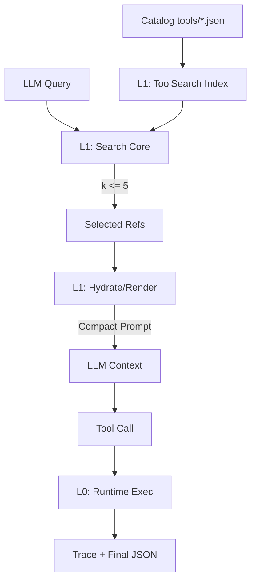

# ADR 003: ToolSearch Layer (Discovery vs Execution)

| Field | Value |
| :--- | :--- |
| **Status** | **ACCEPTED** (2026-02-20) |
| **Owner** | Runtime Team |
| **Objective** | Scale to 1k+ tools via metadata-only discovery without substrate mutation. |
| **Invariants** | `V << G` (Verification << Generation), Replay Parity, NDJSON-only stdout. |

## 1. Context & Rationale

Sprint-1 established a frozen, deterministic runtime substrate (`L0`). Direct prompt injection of all tool definitions is O(N) token-negative and degrades LLM reasoning. **ToolSearch** (`L1`) introduces a metadata-only selection layer to compress context while protecting the `L0` execution boundary.

## 2. Architecture: The 2-Layer Model

| Layer | Responsibility | State | Tools | Output |
| :--- | :--- | :--- | :--- | :--- |
| **L1: Discovery** | Search/Select | Manifests (`JSON`) | Metadata-only | Names-only Refs |
| **L2: Runtime** | Execute/Trace | Trace (`NDJSON`) | `echo`, `readfile`, `bash` | Final JSON |



## 3. Core Contracts

### H0: Manifest Strictness
- **Path**: `tools/*.json`
- **Schema**: `{name, description, input_schema, input_examples, defer_loading}`.
- **Quality**: `description` >= 3 sentences + "not when" guidance; `name` dotted/kebab <= 64 chars.
- **Hot Count**: Catalog must expose 3-5 non-deferred tools. All-deferred is hard-fail.

### H1: Search Determinism
- **Engine**: BM25 (Primary) + Regex (Explicit/Auto-mode).
- **BM25 Weights**: `name*3`, `tags*2`, `description/schema*1`.
- **Tie-Break**: Total-order key `(-score, exact_match, hot_rank, arg_count, name)`.
- **Cap**: Enforced `k <= 5` (Vendor-aligned) to prevent token bloat.

### H2: Hydration & Render
- **Hydration**: Precise `names -> ToolManifest` mapping. Missing ref = `HydrationError`.
- **Rendering**: Emits ONLY `{name, description, input_schema, input_examples}`. Internal fields (tags, defer) are stripped.
- **Safety**: `server-search + include-examples` is a prohibited policy combo (RenderError).

## 4. Implementation Snippets (Expert Reference)

### BM25 Scoring (Index.py)
```python
# Pure Python math.log for platform-stable IDF
idf = log(1 + (N - df + 0.5) / (df + 0.5))
score += idf * ((tf * (k1 + 1)) / (tf + k1 * (1 - b + b * dl / avdl)))
```

### Deterministic Rank (Search.py)
```python
# Stable ordering across Python versions/catalog permutations
def rank_key(hit, query):
    return (
        -hit.score,
        0 if hit.name == query else 1,
        hit.hot_rank,
        hit.arg_count,
        hit.name
    )
```

### Auto-Mode Detection (Search.py)
```python
# Heuristic metachar detection for regex-heavy queries
METACHARES = set("^$[]()|\\.{}*+?")
is_regex = any(c in METACHARES for c in query)
```

## 5. Decision Log

| ID | Decision | Rationale |
| :--- | :--- | :--- |
| **D0** | **Package `pirml/toolsearch`** | Decouple search logic from runtime/protocol boundary. |
| **D1** | **Content-based Cache Key** | Avoids `id(catalog)` fragility across processes/tests. |
| **D2** | **Immutable Cache Results** | `tuple` storage prevents caller mutation of shared results. |
| **D3** | **BM25 Postings Index** | O(N) -> O(|query|) latency reduction for 1k+ tools. |
| **D4** | **Namespace Boost** | Strong preference for `svc.*` tools if query contains `svc.` |

## 6. Verification Matrix

| Invariant | Test Locator | Gate |
| :--- | :--- | :--- |
| Manifest Schema | `tests.test_toolsearch_lint` | `mise run ci` |
| Search Ranking | `tests.golden.toolsearch.search_ranking.json` | `unit` |
| Prompt Render | `tests.golden.toolsearch.prompt_render.json` | `unit` |
| Perf Budget | `out/toolsearch_bench.canonical.json` | `ci` |
| Replay Parity | `python -m scripts.replay_check` | `replay` |

## 7. Operational Walkthroughs

### A. Adding a New Tool
1. Create `tools/my_tool.json`.
2. Run `python -m scripts.tool_manifest_lint --tools-dir tools`.
3. If red: Fix schema or quality (description length, hot tool count).
4. Run `mise run fast` to update golden snapshots.

### B. Debugging Search Recall
1. Run `python -m pirml.toolsearch.search --query "find file" --k 5`.
2. Check `stderr` for IDF weights and token counts.
3. Verify if `exact_match` or `namespace_boost` are masking expected BM25 hits.

### C. Performance Benchmarking
1. `python -m scripts.tool_search_bench`
2. Compare `out/toolsearch_tokens.json` (`selected_bytes` vs `full_bytes`).
3. Ensure `index_ms` < 10ms for 1000 tools.
