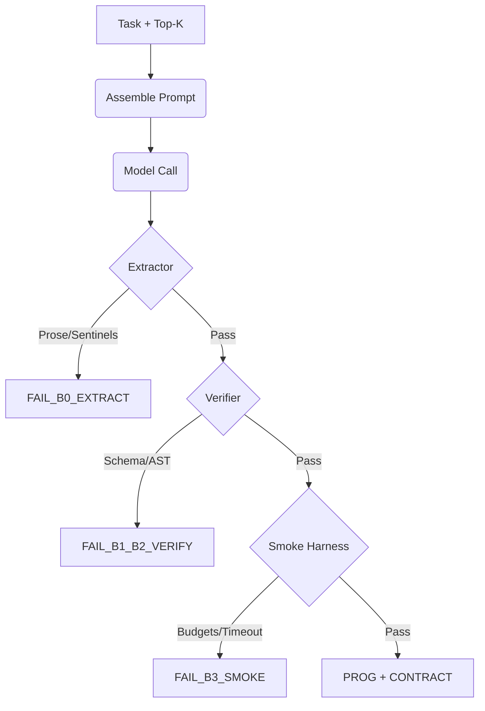

# ADR 004: PIRML Compiler L1 + Smoke + Verifier Hardening

## Status
**Proposed** / **Implemented** (Cycle 4 complete)

## Context
Spec-04 introduces the **L1 Compiler Layer** to the frozen **L0 Runtime Substrate**. Goal: deterministic one-shot compilation (`raw -> prog.py + contract.json`) with sub-second reject power.

## Decision Plane
### 1. Plane Split (L0/L1)
- `L0` (Runtime/Replay): Frozen protocol algebra, monotonic IDs, total trace order, result-only truncation.
- `L1` (Compiler): Additive. zero mutation to `pirml.runtime`. No runtime/rpc/trace changes for compiler convenience.
- **Rule**: Compiler must satisfy `trace_lint` + `replay_check` via the `send_final` RPC frame. Raw stdout JSON is a verifier-level fail.

### 2. Pipeline Algebra
- `Pipeline = Assemble -> Model -> Extract -> Verify -> Smoke -> Artifacts`.
- **Branch Law**: Emit exactly `{prog.py + contract.json}` XOR `{compile_error.json}`. Never mixed/partial.
- **Fail-Fast**: First invariant break terminates pipeline. No downstream execution on invalid code.

### 3. Strict Extractor (C1)
- **Law**: 2-sentinel frame `<<<PROG>>>` then `<<<CONTRACT>>>`.
- **Constraint**: Cardinality check = 5. No leading/trailing/interstitial prose allowed. `strip()` for byte-stability.
- **Model Adapter**: `StubModelAdapter` for CI/unit parity via `PIRML_MODEL_RAW|FILE`.

### 4. Fail-Closed Verifier (C2)
- **Contract**: Schema-backed (`compile_contract.schema.json`). `additionalProperties: false` everywhere.
- **AST Law**:
  - **Imports**: Allowlist only (`pirml.runtime.rpc`, `asyncio`, `math`, etc).
  - **Structure**: Exactly one `async main`; exactly one `send_final` call.
  - **Calls**: No raw `print` (stdout chatter). Awaited `TOOL_*` calls only.
  - **Parallelism**: Mandatory `asyncio.gather` for independent fanout. Serial allowed ONLY for `SERIAL_OK` reasons.

### 5. Deterministic Smoke (C3)
- **Harness**: Sequence clock (`seq_ms=1000, +100`). Wall-clock forbidden.
- **Budgets**: Enforce `max_calls`, `max_parallel`, `max_bytes_in`, `max_bytes_out`, `timeout_s`.
- **Trace Law**: Always emit `smoke_trace.ndjson`. Map failures to `FAIL_B3_*` codes in `compile_error.json`.

### 6. Artifact & Gate Discipline
- **Unified Error**: `{ok:false, errors:[], warnings:[], stage:str}` in `compile_error.json`.
- **Schema Gate**: Explicit artifact paths only (`--final/--contract/--compile-error`). No recursive `out/**` scan.
- **Replay Preflight**: Strict trace validation (`seq/dir/ms/sha`) mandatory before program spawn.

## Engineering Doctrine
- **D0**: Deterministic x3 proof for all trace/artifact bytes.
- **D1**: Repair-once = syntax canonicalization ONLY. No semantic synthesis of missing fields.
- **D2**: Golden artifacts are contractual bytes. No self-healing in tests.

## Diagrams / Snippets

### Pipeline Flow

### Trace Parity
Smoke harness post-processes stdout to inject deterministic sequence:
`{"id":"c00001","seq":1,"ms":1000,"dir":"in","sha256_args":"...","op":"call","tool":"pirml.echo","args":{...}}`
