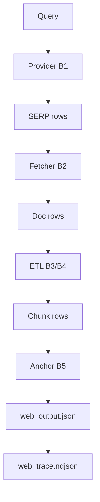

# ADR 005: PIRML Spec-05: Deterministic Web Substrate & Winner Selection

## Status: ACCEPTED (2026-02-21)

## Context
Spec-05 adds an L1 web substrate to the frozen L0 PIRML runtime. Goal: Q->SERP->Fetch->ETL->Cite->Answer w/ strict determinism, minimal token overhead (V<<G), and evidence-linked accuracy.

## Decision

### 1. Orchestration: `WebPlan` Switchboard
- **Polymorphism:** `WebPlan` (dataclass) encodes all B1-B5 variant switches.
- **Fail-Closed:** `resolve_plan` rejects unknown/loser variants. No implicit fallbacks.
- **Isolation:** `WebPipeline.run(q, plan)` is self-contained; per-run boilerplate cache only.

### 2. Selection: Lexicographic Metric Matrix
- **Winner Rule:** Lexicographic max on `(acc, -bytes, -chunks, -fetches, cache_hit)`.
- **Bets Locked:**
  - **B1a (SearxJson):** `urllib` + `to_thread` async fetch; deterministic diversify.
  - **B2a (SqliteCache):** WAL mode, atomic put-by-byte-hash, 304 revalidation.
  - **B3b (FallbackExtract):** Regex `<script|style>` kill + robust tag strip; 800c chunks.
  - **B4b (BM25Scorer):** Token-overlap relevance ranking; stable tie-breaks.
  - **B5a (QuoteAnchor):** Resolvable quote span + 220c/25w cap + SequenceClock `retrieved_at`.
- **Winner Tuple:** `(B1a, B2a, B3b, B4b, B5a)`.

### 3. Plane Split & Boundary (H0/H9)
- **L0 Freeze:** Runtime tool surface remains `{echo, readfile, bash}`. Web is an L1 library, not a tool-surface extension.
- **Channel Split:** `web_output.json` contains `{answer, citations, trace_ptr}`. No raw HTML in `final.json`.
- **Trace Pointer:** `trace_ptr` resolves to `web_trace.ndjson` containing search/fetch frames.

### 4. Determinism Law (HC1/T0)
- **Clock:** `SequenceClock` ticks for all `ts/ms/retrieved_at` fields.
- **Artifacts:** `canonical_json` (sorted keys, compact) for all NDJSON/JSON artifacts.
- **Fixtures:** `FixtureDocFetcher` + `responses.json` enables 100% offline, replay-stable eval matrix.
- **Byte Law:** Hash computed over persisted bytes only; normalize row sha/bytes before cache put.

### 5. Verification: Gate Ladder (G1/G2)
- **Fast:** Includes `<3s` top web regressions (urlnorm, search, eval-parse).
- **Schema:** `schema_lint` requires explicit paths; validates `web_output.json` + `web_trace.ndjson` + `citation.ndjson` parity.
- **Replay:** `scripts/replay_check` ensures L1 web pipeline doesn't break L0 substrate parity.

## Walkthroughs

### A. Web Pipeline Flow (L1)


### B. Winner Verdict (`out/web_eval.canonical.json`)
```json
{
  "winner_id": "(B1a,B2a,B3b,B4b,B5a)",
  "metric_tuple": [0.6954, -212, -1, -1, 0.0],
  "seed": 0,
  "n": 50
}
```

### C. Citation Frame (`citation.ndjson`)
```json
{
  "doc_sha": "e3b0c442...",
  "url": "https://example.com/a",
  "quote": "The winner of the 2026 election...",
  "chunk_id": "c001",
  "retrieved_at": "2026-02-21T12:00:01Z"
}
```

## Consequences
- **Deterministic Replay:** Every run auditable via `web_trace.ndjson`.
- **Minimal Context:** Top N chunks (<40) ensure answer quality without token bloat.
- **Substrate Stability:** L0 runtime remains simple/frozen; web evolves in L1.
- **Metric Authoritative:** Winner selection is objective, repeatable, and fraud-proof.
