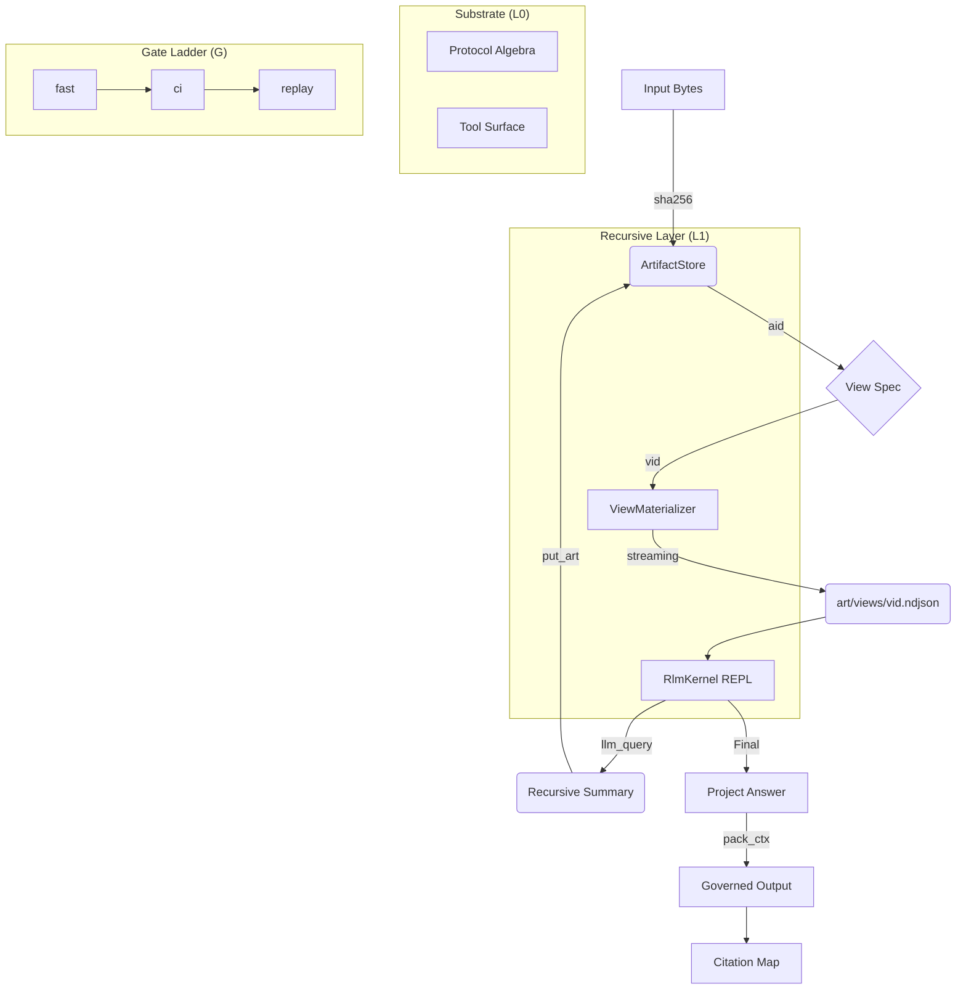

# ArtifactFS + RLM Workflow



## View DSL Examples

### Lines Slice
```json
{
  "op": "lines",
  "a": 0,
  "b": 100
}
```

### Regex Slice
```json
{
  "op": "regex",
  "pat": "ERROR|FATAL",
  "max_hits": 50
}
```

### HTML to Text
```json
{
  "op": "html_text",
  "drop": ["script", "style", "noscript"],
  "max_chars": 200000
}
```
