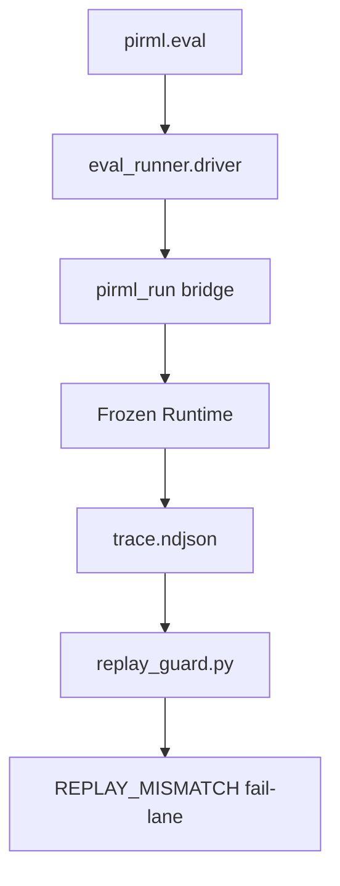

# ADR 008: EVAL+REGRESSION KERNEL (L1 WRAPPERS)

## STATUS: SUPERSEDED BY LIVE EVIDENCE (SPEC-08)
**CONTEXT:** BrowseComp (1266 tasks) requires objective scoring/replay/costing. L0 (runtime/tool/protocol) is frozen. Spec-08 ships L1 orchestration, sharded runner, and KPI reporting.

## 1. ARCHITECTURE: L0/L1 ISOLATION
**DECISION:** Ban L0 mutation. All eval logic exists as L1 modules/wrappers.
- **BRIDGE:** `pirml.eval` -> `pirml_run` -> `pirml.ux.runtime_bridge` -> `python -m pirml`.
- **RESULT:** Runtime remains `{echo,readfile,bash}`. Replay parity is preserved.



## 2. SHARDED RUNNER + RESUME LAW
**DECISION:** Append-only NDJSON shards. Idempotent resume.
- **SHARDING:** `shard = sha1(task_id) % N`.
- **INTEGRITY:** `seq 1, +1`. One terminal row per `task_id`.
- **RESUME:** `note=resume_skip` audit rows. Never rewrite historical bytes.

## 3. EVIDENCE LAW: POINTERS + SCHEMAS
**DECISION:** Every run emits resolvable pointers. Schema-lint validates explicit artifacts.
- **POINTERS:** `pi_ptr` in `custom.data` (not context). `trace_ptr` relative to shard log.
- **COMPACTNESS:** `final.json` root fixed to `{ok,results,output?,meta?}`. Bulky data -> artifacts.

## 4. DETERMINISTIC SCORING + TAXONOMY
**DECISION:** Exact-match core. No wall-clock in scored metrics.
- **ACC:** Persisted `acc` is exact (zero jitter).
- **TAGS:** Single-label taxonomy (`TIMEOUT|SEARCH_BAD|ETL_BAD|...`).
- **NO_CITE:** Explicitly tracked and penalized.

## 5. REPLAY-GUARD AUTHORITY
**DECISION:** Replay outranks live.
- **ENFORCEMENT:** Runner executes real per-task replay snapshot under `PIRML_BLOCK_TOOLS=1`.
- **FAIL-LANE:** Mismatch/error maps to `REPLAY_MISMATCH`.

## 6. REGRESSION GATES (GOLDEN vs FULL)
**DECISION:** Tiered verification.
- **CI (Golden50):** Regression on `Δacc < 0` or `Δcost > X%`.
- **NIGHTLY (Full1266):** Pareto analysis + top-N failing traces + KPI wall.

## 7. KPI WALL (PTC PROOF)
**DECISION:** Measure PTC value: `bytes_into_model` must be tiny vs `bytes_fetched`.
- **METRICS:** `fanout_peak`, `tool_calls`, `acc_per_$`, `acc_per_min`.

## WALKTHROUGH: THE PROOF CHAIN
```bash
# 1. Fast reject
mise run fast

# 2. Authority gate
mise run ci

# 3. Eval smoke (Golden)
mise run eval-golden

# 4. Report + Pareto
mise run eval-report

# 5. Replay Parity
python -m scripts.replay_check
```

## ANTI-PATTERNS (REJECTED)
- **A0:** Parallel scale claims beyond `jobs=1` runner (use process fanout).
- **A1:** Hidden dataset discovery (use explicit `--dataset`).
- **A2:** Mutating shard logs for enrichment (use sidecars).
- **A3:** Context-poisoning via heavy pointers (use `custom.data`).
