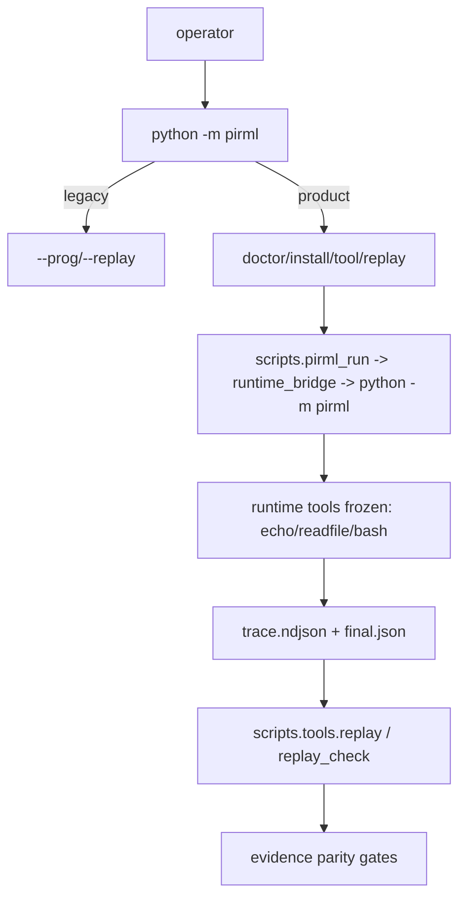

# ADR 009: L1 Product Shell, Policy Choke-Point, Proof-First Closure

## Context
Spec-09 solved UX/operator friction without violating frozen L0 substrate. Inputs audited in full: `spec-0/00-learnings.jsonl`, `spec-0/09-htn.jsonl`, all `spec-0/09/*.jsonl`, `spec-0/09-tasks.jsonl`, `spec-0/09-tutorial.jsonl`.

Core tension: add product surface (`doctor/install/tool/replay`) while preserving `H4/H7/H22` (protocol/tool/owner freeze), `H11/H32` (strict parse/fail-closed), `H2/H31` (authority gates immutable + rerun clean).

## Decision
Adopt strict L1-only productization:
1. Keep runtime/replay protocol/tool registry immutable.
2. Add product CLI as wrapper router over existing owner path.
3. Move misuse prevention to nearest choke-point (extension interceptors first, runtime adapter second).
4. Treat docs/snippets/tasks/tutorial/learners as executable contracts; stale prose loses.
5. Accept only executable proof bundles as done authority.

## Why This Wins
- Min state-space (`D0/D4`): wrappers over rewrites.
- Max verifiability (`H8/H16/H31`): replay/artifact/parity + typed fail lanes.
- Hard-to-misuse by default (`S6`): unknown/missing/invalid => typed `config`/`validation`/`unsupported`; no `usage:` leakage.

## Architecture (Winner Path)


## Invariant Ledger (Opinionated)
- `INV-L0`: no runtime tool growth beyond `{echo,readfile,bash}`.
- `INV-PROTO`: `op∈{call,result,final,custom}`, one terminal `final`, strict `id/seq`, hash persisted bytes only.
- `INV-BOUNDARY`: `final.json` root fixed `{ok,results,output?,meta?}`; rich payload in artifacts/custom.
- `INV-PARSE`: every parser/subparser/legacy path uses strict typed stderr JSON + `rc=2` on config parse errors.
- `INV-MANIFEST`: schema/TypedDict/lint/compile caller-policy unified, fail-closed, additive-only.
- `INV-POLICY`: extension `tool_call/tool_result` enforce allow/deny/confirm + truncation/redaction hint cap.
- `INV-RUNTIME`: policy adapter optional/additive; retries only idempotent; caps/timeouts deterministic.
- `INV-PROOF`: helper gates additive only; `ci` order unchanged; done requires post-edit proof rerun.

## Cycle Walkthrough (C0->C7)
1. `C0` froze contradictions + owner/enforcement map + declared pass/fail lanes first.
2. `C1` added product shell (`doctor/install/uninstall/replay`) without touching legacy byte-path.
3. `C2` locked manifest contract (`idempotent/cacheable/max_payload_bytes/timeout_s/retry/allowed_callers`) + XOR caller policy.
4. `C3` shipped deterministic `pirml tool init|lint|pack` and bootstrap-safe lint lane.
5. `C4` split extension policy into pure choke-point modules (`policy_call`,`policy_result`) + command routing.
6. `C5` added compile/runtime policy seam via shared parser, strict verifier, additive runtime adapter.
7. `C6` materialized smoke+chaos+gate-contract proofs; preserved gate byte contracts.
8. `C7` winner-lock: deleted stale loser surfaces, enforced doc/snippet parity, reran authority chain clean.

## Concrete Examples
```bash
# parse-law fail lanes: must be typed JSON stderr, rc2, no `usage:`
python -m pirml replay tests/prog_ok.py out/ci/trace.ndjson --timeout nope
python -m pirml doctor --home
python -m pirml tool init
python -m pirml tool lint --tools-dir
python -m pirml tool pack --out
```

```bash
# canonical golden lane
python -m pirml tool init demo.spec09 --tools-dir .tmp/t/tools
python -m pirml tool lint --tools-dir .tmp/t/tools
python -m scripts.pirml_run --prog tests/prog_ok.py --out-dir out/spec09_smoke --project-root .
python -m scripts.tools.replay tests/prog_ok.py out/spec09_smoke/trace.ndjson --out-dir out/spec09_replay
```

```json
{"type":"config","msg":"invalid float for --timeout: nope","retryable":false}
```

## Rejected Alternatives
- Runtime policy-only enforcement (too far from operator action; higher leakage risk).
- Dual manifest dialect (schema/type/lint drift factory).
- Folding heavy helper lanes into `fast`/`ci` (authority mutation).
- Keeping stale commands in docs “for convenience” (hard drift + false capability).

## Consequences
- Positive: safer UX, deterministic authoring, replay-preserving policy hardening, stronger machine-lane diagnostics.
- Cost: stricter failure behavior (more early rc2/rc1), heavier parity discipline.
- Risk control: matrix owner/test refs + declared fail lanes + post-edit proof bundle.

## Authority Proof Bundle (Close Bar)
```bash
python -m unittest -q tests.test_spec09_c7_hardening_sync
python -m unittest discover -s tests -p 'test_spec09*.py' -q
npx tsx tests/test_spec09_c4_extension_policy.ts
python -m scripts.spec09_tool_smoke
python -m scripts.spec09_eval_chaos
python -m scripts.spec09_report_smoke
python -m scripts.replay_check
python -m scripts.artifact_rebuild --check
mise run fast
mise run ci
```

## Status
Accepted, enforced, and evidenced as of `2026-02-23` via `spec-0/09-tasks.jsonl` + C7 proof bundle.
