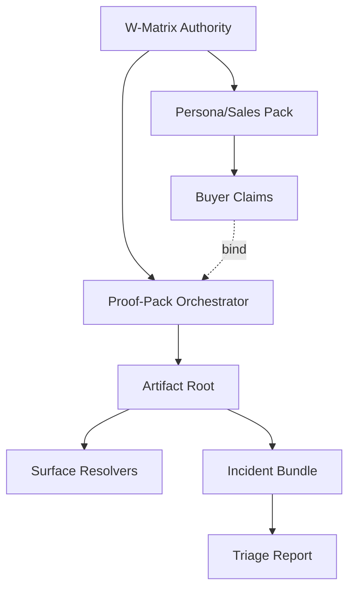

# ADR 010: Integrity & Evidence Productization

**Status:** PROVEN (C7-Done)
**Owner:** Product + Engineering (Unified)
**Authority:** `spec-0/10-tasks.jsonl`

## Context
Post-Spec09, the L0 boundary (runtime/replay/protocol) is frozen. Business needs GTM-ready evidence, one-click incident triage, and unified UX without eroding the "Replay-Verifiable" value prop. Ad-hoc aliases and dashboard-only evidence create "Authority Drift" (W3/X3).

## Decision: Wrapper-Only Orchestration
Reject data-plane mutation. Implement Spec10 as a pure L1 composition layer.

1.  **Command Matrix (`C1`):** `spec-0/10/21-command-matrix.jsonl` is the *single* source of authority for all walkthroughs (W0..W10). Owners must be `scripts.pirml_run`, `scripts.compile`, or `mise`.
2.  **Proof-Pack (`C2`):** A deterministic orchestrator that executes the matrix and emits a JSONL index with `{lane, rc, sha256, trace_ptr, final_ptr}`. Success requires 100% pointer resolvability.
3.  **Incident Bundle (`C3`):** MTTR compression via `scripts.spec10_incident`. Chain: `trace -> classify -> replay (blocked tools) -> artifact parity`. Hard-fail on parity drift (RC=2).
4.  **Surface Resolvers (`C4`):** Read-only CLI views (`console|evidence|eval|policy`) over existing artifacts. Zero new state.
5.  **Persona Packaging (`C5`):** Sales claims (`buyer, hook, objection_kill`) mapped directly to `proof_pack` rows.

## Consequences
- **V<<G Verified:** Replay-guard enforced on every release claim.
- **Zero-Drift UX:** `pirml run|surface|incident` delegate to authoritative wrappers; no parallel logic.
- **Fail-Closed:** All new surfaces use strict `argparse` + typed JSON stderr; no `usage:` leak.

## Architecture Diagram


## Walkthroughs (W0..W10)
| ID | Lane | Owner | Proof Command |
| :--- | :--- | :--- | :--- |
| W0 | Sales-Proof Burst | PO | `mise run ci && python -m pirml run ...` |
| W1 | Replay Integrity | QA | `python -m pirml replay ...` |
| W9 | Incident Triage | FDE | `python -m pirml incident ...` |
| W10 | Gov Close | ALL | `mise run ci` |

## Verification Matrix (I00..I24)
- **I05:** Replay outranks live (Replay-Guard parity).
- **I11:** Incident ingress validates strict trace contract.
- **I22:** Proof-pack x3 byte-stable (PYTHONHASHSEED=0).

## Drill Snippets
```bash
# Incident Triage (one-command)
python -m pirml incident --trace out/ci/trace.ndjson --out-dir out/triage

# Surface Resolver (read-only)
python -m pirml surface console --run out/ci

# Sales Pack Generation
python -m scripts.spec10_sales_pack --out out/sales
```
