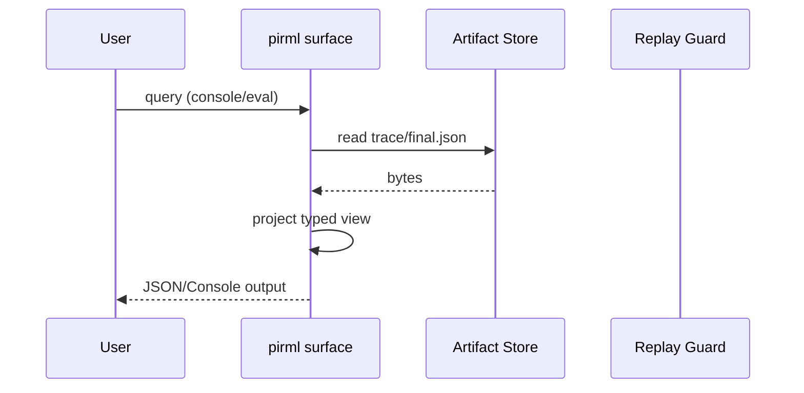
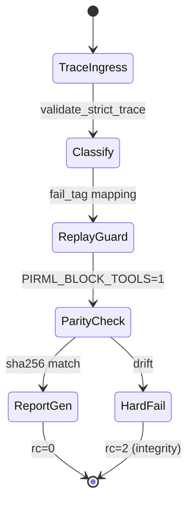

# Diagrams: ADR 010

## Data Flow

```mermaid
sequenceDiagram
    participant User
    participant CLI as pirml surface
    participant Store as Artifact Store
    participant Guard as Replay Guard

    User->>CLI: query (console/eval)
    CLI->>Store: read trace/final.json
    Store-->>CLI: bytes
    CLI->>CLI: project typed view
    CLI-->>User: JSON/Console output
```

## Incident Chain

```mermaid
stateDiagram-v2
    [*] --> TraceIngress
    TraceIngress --> Classify: validate_strict_trace
    Classify --> ReplayGuard: fail_tag mapping
    ReplayGuard --> ParityCheck: PIRML_BLOCK_TOOLS=1
    ParityCheck --> ReportGen: sha256 match
    ReportGen --> [*]: rc=0
    ParityCheck --> HardFail: drift
    HardFail --> [*]: rc=2 (integrity)
```
