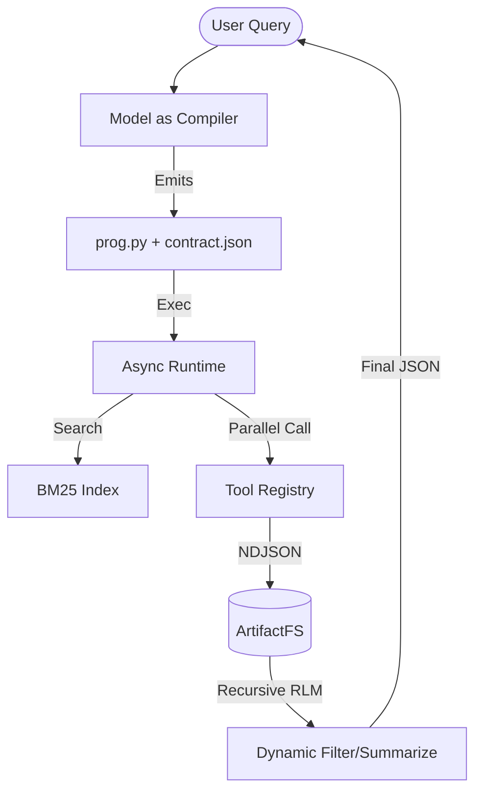

# RFC 000: PiRLM-Fabric - The Agentic Substrate

**Status:** PROPOSED  
**Author:** PiRLM Core  
**Date:** 2026-02-19  

## Abstract
Pivot from "Chatty Agent" (serial RPC, context bloat) to **"Compiler Agent"** (single-shot PTC, off-context ETL).  
PiRLM-Fabric is a **stdlib-only (py3.12)** substrate that executes model-generated `prog.py` miniprograms.  
Key: **Intermediates die in the runtime; only final distill enters the LLM context.**

---

## 1. The Core Loop (PTC + RLM)

### 1.1 Architecture Diagram


### 1.2 The "Compiler" Contract
Model emits `prog.py` (logic) and `contract.json` (schema).  
**HC4 Alignment:** One model call -> `prog.py`. No serial round-trips for control flow.

---

## 2. Technical Specs

### 2.1 Tool Discovery (BM25 Pushdown)
**HC3:** Avoid 100k-token catalogs.
```python
# pirml/toolsearch/search.py
def search_tools(catalog: dict, query: str, k=5):
    # BM25 + Regex over tools/*.json
    # Return Top-K manifests for compiler prompt
```

### 2.2 Programmatic Tool Calling (PTC)
`prog.py` is async. Use `asyncio.gather()` for fan-out.
```python
# Example prog.py emitted by model
import asyncio
from pirml.runtime.rpc import send_final

async def main():
    # 1. Parallel Search via TOOL_* wrappers (generated)
    results = await asyncio.gather(
        TOOL_web_search({"q": "X"}),
        TOOL_web_search({"q": "Y"})
    )
    # 2. Dynamic Filtering (ETL)
    # Filter 10MB HTML -> 10KB JSON snippets
    distill = [r.get("text")[:1000] for r in results if r.get("ok")]
    
    # 3. Final Distill via RPC send_final
    send_final(True, {"data": distill, "citations": []})

if __name__ == "__main__":
    asyncio.run(main())
```

### 2.3 RLM Recursion (Artifact Slicing)
**HC6:** "Long context" is an environment, not a buffer.
- `map(slices) -> sub-summaries`
- `reduce(summaries) -> final_view`

---

## 3. Protocol: NDJSON Frames
**HC1:** Strict NDJSON for traces and RPC.
- `{"op": "call", "id": "c001", "tool": "...", "args": {...}}`
- `{"op": "result", "id": "c001", "ok": true, "output": "..."}`
- `{"op": "final", "result": {...}}`

---

## 4. Why this wins
1. **Latency**: Serial loops (N calls = N roundtrips) -> PTC (1 roundtrip).
2. **Precision**: Tool examples in manifests -> 72% -> 90% accuracy.
3. **Scale**: RLM recursion handles 100MB inputs by treating artifacts as an external FS.

## 5. UX: pi-mono Integration
**HC7:** Leverage `pi-mono` as the terminal session store.
- **Session Tree**: Every `prog.py` execution is a node in the `pi` session JSONL.
- **Artifact Links**: Trace and artifact pointers are embedded in session messages.
- **Compaction**: `pi` handles history pruning; PiRLM handles data pruning via RLM.

---

## 6. Implementation Path (Sprint 1-2)
1. **ToolRegistry**: JSON manifests + `execute()` hook.
2. **ExecEngine**: Subprocess runner for `prog.py` with stdio-based NDJSON RPC.
3. **ArtifactFS**: Immutable content-addressed storage for ETL intermediates.
